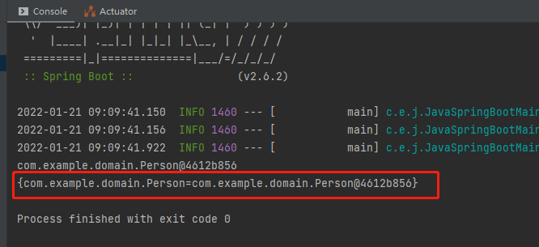
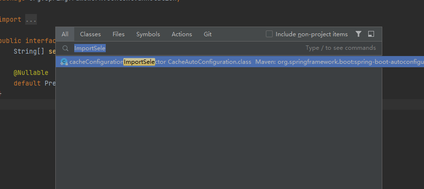
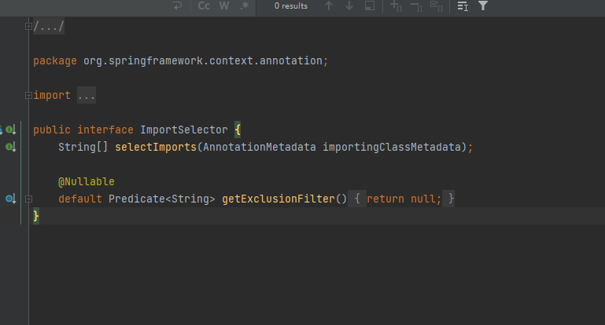
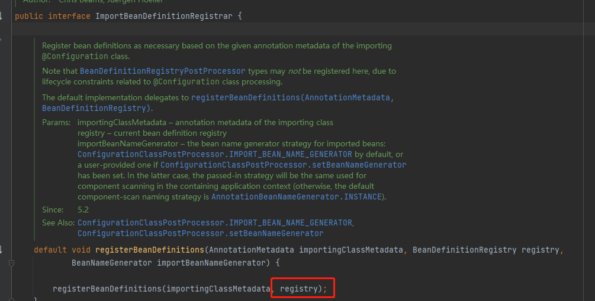

---
import注解详解
---

Enable*底层依赖于Import注解导入一些类，使用Import导入的类回本Spring加载到IOC容器中，而Import提供4种用法：

1. 导入Bean
2. 导入配置类
3. 导入ImportSelector实现类，一般用于加载配置文件中的类
4. 导入ImportBeanDefinitionRegistrar实现类

下面我们一一讲解

## 1. 导入Bean

我们之前在java-springBoot-other项目中写了一个Person的类，然后又写了他的配置类，接下来我们通过Import获取这个Bean

我们在java-springBoot-main项目中添加Import注解，添加Person的class，然后获取一下这个Bean

```
@SpringBootApplication
@Import(Person.class)
public class JavaSpringBootMainApplication {
    public static void main(String[] args) {
        ConfigurableApplicationContext context = SpringApplication.run(JavaSpringBootMainApplication.class, args);
        Object person = context.getBean("person");
        System.out.println(person);
    }
}
```

运行项目之后发现报错，没有找到这个Bean，这是因为导入之后这个Bean不一定叫这个名字，我们可以通过类型获取：

```
@SpringBootApplication
@Import(Person.class)
public class JavaSpringBootMainApplication {
    public static void main(String[] args) {
        ConfigurableApplicationContext context = SpringApplication.run(JavaSpringBootMainApplication.class, args);
        Object person = context.getBean(Person.class);
        System.out.println(person);
    }
}
```
这样就找到这个Bean，我们也可以获取一下这个Bean到底叫什么名字

```
@SpringBootApplication
@Import(Person.class)
public class JavaSpringBootMainApplication {
    public static void main(String[] args) {
        ConfigurableApplicationContext context = SpringApplication.run(JavaSpringBootMainApplication.class, args);
        Map<String, Person> beansOfType = context.getBeansOfType(Person.class);
        System.out.println(beansOfType);
    }
}
```

可以看一下这个map集合


# 2. 导入配置类

这个方法之前已经讲过，我们直接看代码
```
@SpringBootApplication
@Import(PersonConfig.class)
public class JavaSpringBootMainApplication {
    public static void main(String[] args) {
        ConfigurableApplicationContext context = SpringApplication.run(JavaSpringBootMainApplication.class, args);
        Object person = context.getBean(Person.class);
        System.out.println(person);
    }
}
```
这样也是可以导入的

# 3. 导入ImportSelector实现类

在说这个之前我们先看一下ImportSelector，这其实是一个接口，我们可以双击shift搜索一下



点到这个类里看一下



这个类里有一个方法selectImports，这个方法最终是要被实现，他返回字符串类型的数组，数组中的元素其实就是类的全类名

下面我们实现一下

在项目2 `java-springBoot-other`中的配置类中新增一个类叫 MyImportSelector, 并添加如下代码：

```
public class MyImportSelector implements ImportSelector {
    @Override
    public String[] selectImports(AnnotationMetadata importingClassMetadata) {
        return new String[]{"com.example.domain.Person"};
    }
}
```
这个字符串数组可以添加任何你手写的Bean，但是这个是写死的，将来可以把这个写在配置中，然后我们从这里动态获取

然后我们在项目1中导入这个类，就可以获取了

```
@SpringBootApplication
@Import(MyImportSelector.class)
public class JavaSpringBootMainApplication {

    public static void main(String[] args) {
        ConfigurableApplicationContext context = SpringApplication.run(JavaSpringBootMainApplication.class, args);
        Object person = context.getBean(Person.class);
        System.out.println(person);
    }
}
```
运行一下程序可以看到控制台打印了Person这个Bean

# 4. 导入ImportBeanDefinitionRegistrar实现类



其中registry这个参数就可以往IOC容器中注册一些对象，下面我实现一下这个接口

在项目2中的配置类中新增一个类 MyImportBeanDefinitionRegistrar，添加如下代码：

```
public class MyImportBeanDefinitionRegistrar implements ImportBeanDefinitionRegistrar {
    @Override
    public void registerBeanDefinitions(AnnotationMetadata importingClassMetadata, BeanDefinitionRegistry registry, BeanNameGenerator importBeanNameGenerator) {
        AbstractBeanDefinition beanDefinition = BeanDefinitionBuilder.rootBeanDefinition(PersonConfig.class).getBeanDefinition();
        registry.registerBeanDefinition("user", beanDefinition);
    }
}
```

然后在项目1中导入这个类并获取一下

```
@SpringBootApplication
@Import(MyImportBeanDefinitionRegistrar.class)
public class JavaSpringBootMainApplication {
    public static void main(String[] args) {
        ConfigurableApplicationContext context = SpringApplication.run(JavaSpringBootMainApplication.class, args);
        Object person = context.getBean(Person.class);
        System.out.println(person);
    }
}
```

运行项目可以看到能够打印 Person这个Bean, 如果我们把getBean的参数改成字符串person，也是能够获取的，因为我们在注册的时候指定了名字


[返回首页](../README.md)


